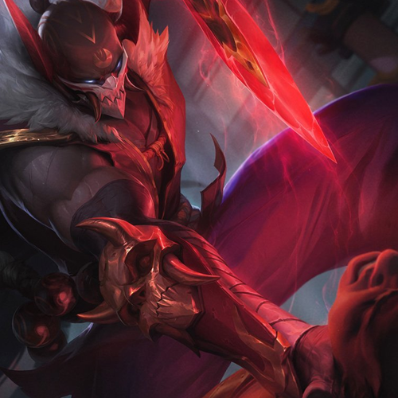

# Pixel Bot

Pixel Bot is a pretty cool bot filled with funny stuff & gaming related stuff also anime stuff, leveling system, balance and lots of fun!

## Commands

Pixel Bot Commands:

|📎 - Core                |Description                         |Use                         |
|----------------|-------------------------------|-----------------------------|
|ping|`'Get the time it took the bot to reply.`|<p!ping> |
|server|`JAPAN's Discord invite.`|<p!server>|
|invite|`Invite the bot to your server.`  |<p!invite>  |
|support|`'Support's Bot server` |<p!support>  |
|serverinfo|`Get the info of the server` |<p!serverinfo>  |
 #
|💎 - Social                |Description                         |Use                         |
|----------------|-------------------------------|-----------------------------|
|profile|`Get your profile's Image/Get someones profile's Image.`|<p!profile/p!profile <@someone>> |
|marry|`Ask to marry with someone.`|<p!marry <@someone>>|
|mymarry|`Your current wife or husband.`  |<p!mymarry>  |
|divorce|`Divorce of your current marry.` |<p!divorce>  |
|level|`Get level card.` |<p!level>  
#
|💳 - Economy              |Description                         |Use                         |
|----------------|-------------------------------|-----------------------------|
|balance|`Get your balance/Get someones balance.`|<p!balance/p!balance <@someone>> |
|daily|`Claim your daily $250.`|<p!daily>|
|slots|`Play slots.`  |<p!slots>  |
#
|🎱 - Fun & Games              |Description                         |Use                         |
|----------------|-------------------------------|-----------------------------|
|8ball|`Answers yes or no questions.`|<p!8ball> |
|flip|`Play with a coin.`|<p!flip <head/tail>>|
|ship|`Ship two people.`  |<p!ship <@tag1> <@tag2>>  |
|ratewaifu|`Rate your waifu.`|<p!ratewaifu> |
|catch|`Play catching pokemon, use p!catch help for more.`|<p!catch>|
|mine|`Play minecraft mining, use p!mine help for more.`  |<p!mine>  |
#
|🎧 - Music            |Description                         |Use                         |
|----------------|-------------------------------|-----------------------------|
|play|`Play a song.`|<p!play <Your song's link or name>> |
|stop|`Stop queue.`|<p!stop>|
|np|`What's now playing.`  |<p!np>  |
|queue|`Get current list.`|<p!queue> |
|pause|`Pause current song.`|<p!pause>|
|resume|`Resume current song.`  |<p!resume>  |
|lyrics|`Lyrics of current song.`|<p!lyrics> |
|skip|`Skip current song.`|<p!clear>|
#
#And more...
